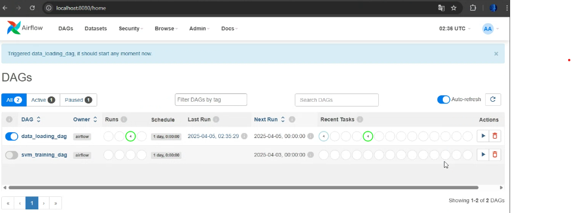
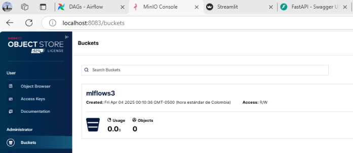
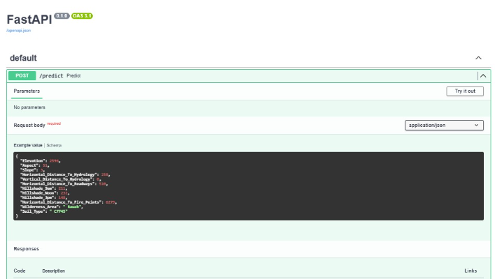
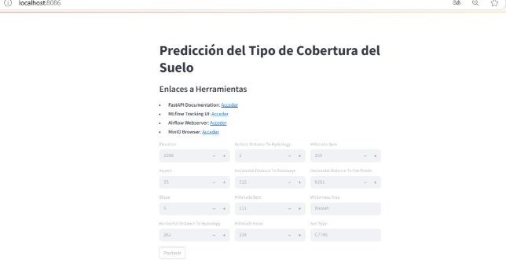

# 📌 Proyecto 2 - Nivel 2: Orquestación, métricas y modelos

Este proyecto proporciona una arquitectura basada en Docker para la orquestación de flujos de trabajo en ciencia de datos utilizando Apache Airflow, MLflow y MinIO. La configuración incluye varios servicios para la gestión de datos, modelos de machine learning y visualización de resultados.

---

## 🖥 Tecnologías Utilizadas

  1. Apache Airflow: Para la orquestación de flujos de trabajo.
  2. MLflow: Para la gestión y seguimiento de experimentos de machine learning.
  3. MinIO: Para el almacenamiento de artefactos y modelos.
  4. PostgreSQL: Base de datos para Airflow.
  5. MySQL: Base de datos para MLflow.
  6. Redis: Cola de mensajes para Celery en Airflow.
  7. Streamlit: Interfaz web para la visualización de resultados.
  8. FastAPI: Servicio de inferencia para modelos desplegados.

---

## 📌 Descripción

**Este proyecto implementa una arquitectura basada en Docker para la orquestación de flujos de trabajo en ciencia de datos, combinando Apache Airflow para la automatización de procesos, MLflow para la gestión de experimentos de machine learning y MinIO como almacenamiento distribuido de artefactos. Además, incorpora PostgreSQL y MySQL para la gestión de bases de datos, Redis para la mensajería en Celery, FastAPI para la inferencia de modelos y Streamlit para la visualización de resultados. La infraestructura permite ejecutar y monitorear experimentos, almacenar modelos y desplegar servicios de inferencia de manera escalable y reproducible.

## 📂 Estructura del Proyecto

La estructura del proyecto está organizada para garantizar una correcta separación de responsabilidades y modularidad. Los flujos de trabajo se encuentran en la carpeta `dags/`, donde cada script maneja tareas específicas como la carga, eliminación y entrenamiento de datos. La carpeta `datos/` contiene los archivos de entrada requeridos para el procesamiento, mientras que `logs/` almacena los registros de ejecución para facilitar el monitoreo. Los archivos de configuración, como `docker-compose.yml` y `Dockerfile`, permiten la implementación del entorno en contenedores, asegurando escalabilidad y reproducibilidad.

```
Proyecto_2/
│── dags/                      # Definición de flujos de trabajo
│   ├── carga_dato.py          # Carga de datos
│   ├── model_train.py         # Entrenamiento del modelo
│── datos/                     # Almacenamiento de datos
│── inference/                 # Inferencia del modelo
│   ├── Dockerfile.app         # Dockerfile para la inferencia
│   ├── main.py                # Script principal de inferencia
│   ├── requirements_app.txt   # Dependencias para inferencia
│── logs/                      # Registro de ejecución
│   ├── README                 # Información sobre logs
│── minio/                     # Configuración para almacenamiento en MinIO
│── mlflow/                    # Configuración de MLflow
│   ├── Dockerfile.mlflow       # Dockerfile para MLflow
│   ├── requirements_mlflow.txt # Dependencias para MLflow
│── mysql/                     # Base de datos MySQL
│── plugins/                   # Extensiones para Airflow
│   ├── README                  # Información sobre plugins
│── streamlit/                 # Interfaz de usuario con Streamlit
│   ├── api_streamlit.py        # API de Streamlit
│   ├── Dockerfile.streamlit    # Dockerfile para Streamlit
│   ├── requirements_streamlit.txt # Dependencias para Streamlit
│── docker-compose.yml         # Orquestación de servicios
│── Dockerfile                 # Construcción de la imagen Docker
│── README.md                  # Documentación del proyecto
│── requirements.txt           # Dependencias generales del proyecto

```
---
## 🛠 Servicios Definidos

  1. **Airflow**
  2. **MLflow**: mlflow_serv: Servidor de MLflow para el seguimiento de experimentos y mysql: Base de datos de MLflow.
  3. **Minio**: para Almacenamiento de objetos para artefactos de MLflow.
  4. **Servicios de Inferencia y Visualización**: se utiliza inference como Servicio de inferencia basado en FastAPI y streamlit como Aplicación web en Streamlit para la visualización de resultados.
---
## ⚙️ Configuración y Variables de Entorno

---
* MLFLOW_S3_ENDPOINT_URL: URL del servidor MinIO.
* AWS_ACCESS_KEY_ID: Clave de acceso a MinIO.
* AWS_SECRET_ACCESS_KEY: Clave secreta de acceso a MinIO.
* AIRFLOW__CORE__EXECUTOR: CeleryExecutor para procesamiento distribuido.
* AIRFLOW__DATABASE__SQL_ALCHEMY_CONN: Conexión a la base de datos de Airflow.
* AIRFLOW__CELERY__BROKER_URL: URL de Redis para Celery.
---

## 🚀 Pasos para Levantar el Contenedor

Para ejecutar este repositorio correctamente, es necesario contar con herramientas y configuraciones específicas. `Docker` y `Docker Compose` permiten la ejecución de los servicios en contenedores, asegurando un entorno reproducible y estable. `Python 3.x` es el lenguaje base para los scripts de procesamiento de datos. Además, las librerías listadas en `requirements.txt`, como `pandas`, `scikit-learn` e `imbalanced-learn`, proporcionan las funcionalidades necesarias para el análisis de datos y entrenamiento de modelos. Finalmente, `Apache Airflow` gestiona la ejecución de tareas automatizadas mediante flujos de trabajo definidos en `DAGs`. Adicionalmente, se recomienda contar con `PostgreSQL` y `MySQL` correctamente configurados para el almacenamiento de metadatos y la gestión de experimentos en MLflow.

1. **Clonar el repositorio** o descargarlo en tu máquina local.
   ```bash
   git clone https://github.com/JohnSanchez27/MLOps_Proyecto_2 #HTTPS
   git clone git@github.com:JohnSanchez27/MLOps_Proyecto_2.git #SSH
   cd MLOps_Proyecto_2

2. **Construir la imagen** definida en el Dockerfile usando Docker Compose:

   ```bash
    docker-compose build

3. **Iniciar el contenedor** en segundo plano:

   ```bash
    docker-compose up -d

4. **Verificar que el contenedor esté corriendo:**
   ```bash
    docker ps

5. **Para ver los logs de un servicio:**
    ```bash
    docker-compose logs -f <nombre_servicio>

5. **Detener los Contenedores**
    Para detener los servicios sin eliminar volúmenes de datos:
     ```bash
    docker-compose down
      ```
    Para eliminar volúmenes y datos persistentes:
    ```bash
    docker-compose down -v
   ```

  Debería ver un contenedor llamado desarrollo_container (o el que hayas definido en docker-compose.yml) en ejecución.

## 🚀 Acceso a los Servicios si se corren localmente en la maquina

---
  1. Airflow UI: http://localhost:8080
  2. MLflow UI: http://localhost:8084
  3. MinIO Console: http://localhost:8083
  4. FastAPI Inference: http://localhost:8085/docs
  5. Streamlit App: http://localhost:8086 
---

## 🏗️ Imagenes del despliegue



Orquestación en Airflow, muestra la estructura de los DAGs y la interconexión entre tareas. Representa cómo los datos fluyen a través de diferentes nodos y cómo se ejecutan en paralelo o en secuencia, asegurando una ejecución eficiente de los flujos de trabajo, para este caso un para carga de datos y otro para entrenamiento.



representación visual de los experimentos gestionados con MLflow. Aquí se documentan los diferentes modelos de machine learning entrenados, junto con sus métricas de evaluación y parámetros de configuración. Este seguimiento permite comparar modelos y seleccionar la mejor versión para producción.

Asi mismo se muestra una vista del almacenamiento en MinIO, donde se gestionan los artefactos generados por los procesos de machine learning. Este sistema actúa como un repositorio central para guardar modelos, datos transformados y otros elementos esenciales para la reproducibilidad del proyecto.



FastAPI se utiliza en la carpeta inference para proporcionar un servicio de inferencia de modelos de machine learning a través de una API RESTful. Esta API permite recibir solicitudes en formato JSON con las características necesarias para la predicción y devuelve los resultados de manera eficiente. La documentación interactiva generada automáticamente por FastAPI facilita la prueba y comprensión de los endpoints disponibles, permitiendo integrar el servicio con otras aplicaciones dentro del ecosistema del proyecto.



esta ultima imagen presenta una interfaz en Streamlit que permite visualizar los resultados de los modelos y su impacto en la toma de decisiones. Se incluyen campos para el usuario que facilitan la insercion de los datos a predecir. 


## 🚀 Reto

Uno de los principales retos de este proyecto ha sido la correcta configuración de los endpoints y las conexiones entre servicios distribuidos. Dado que cada aplicación (Airflow, MLflow, MinIO, FastAPI, Streamlit) se ejecuta en contenedores independientes, ha sido importante establecer rutas y credenciales adecuadas para permitir la comunicación fluida entre ellos. Por ejemplo, el servicio de inferencia debe acceder a modelos almacenados en MinIO utilizando variables de entorno compatibles con MLflow, mientras que Streamlit consume estos endpoints para mostrar resultados en tiempo real. Esta interconexión requiere una sincronización precisa de los puertos, rutas internas en Docker y autenticaciones, lo cual representa un desafío clave al diseñar sistemas orquestados y modulares.